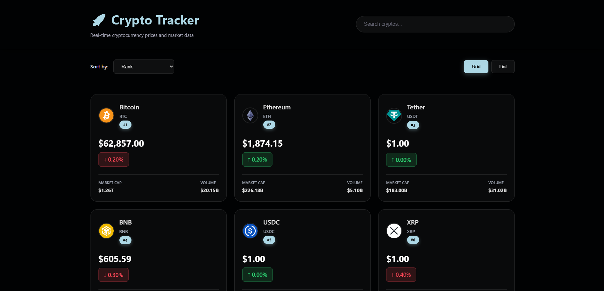
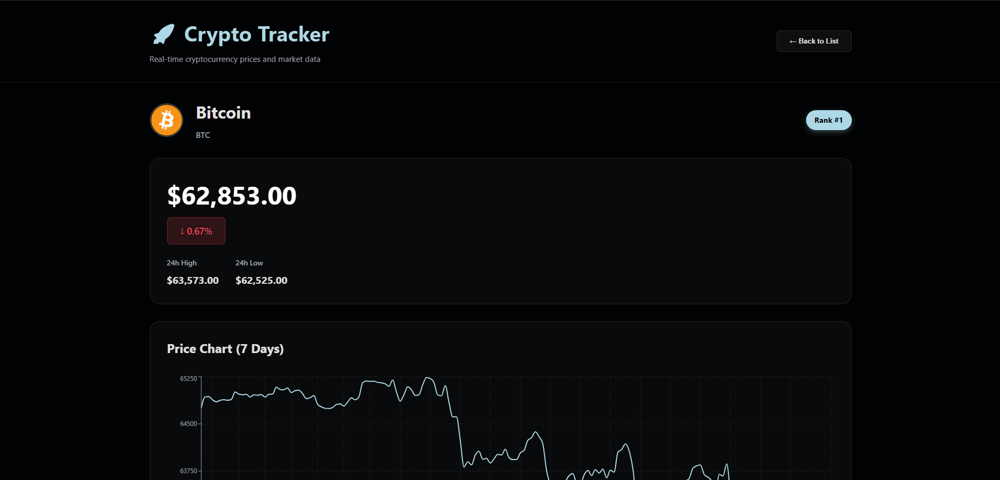
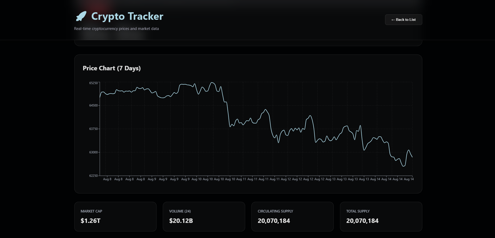

# Crypto Tracker

A modern cryptocurrency tracker built with React.js and the CoinGecko API.

## Features

-  Search cryptocurrencies
-  Sort coins
-  Grid and list views
-  View cryptocurrency details
-  7-day price charts
-  Responsive design
-  React Router navigation

##  Built With

- React.js
- JavaScript
- Axios
- React Router
- Recharts
- CSS
- Vite
- CoinGecko API

##  Run Locally

```bash
npm install
npm run dev
```

##  Preview







